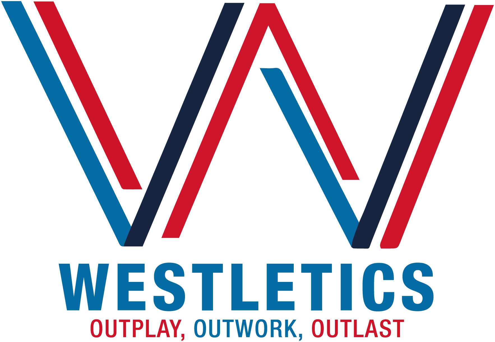
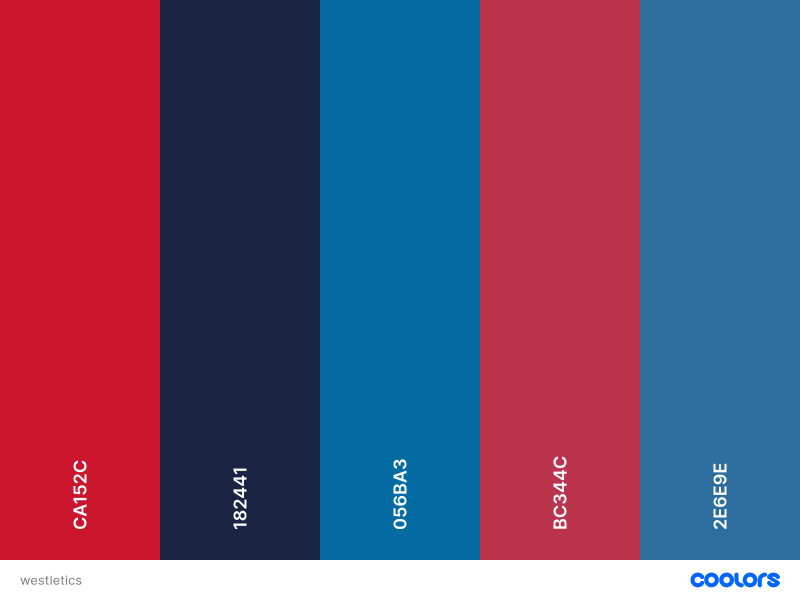
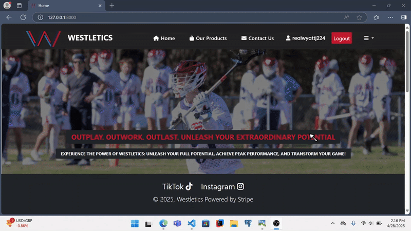

    
  
  # **WESTLETICS**

  ## **DESCRIPTION**
  Westletics is a one-stop shop for all on and off field training equipment and gear a lacrosse player needs. Westletics also aims to help players reach their full potential by providing built-in scheduling to allow coaches to keep up with their player’s needs.

  COLOR PALETTE            |  DEMO
:-------------------------:|:-------------------------:
   |   

## **KEY FEATURES:**
- Shop for Sporting good in the products section
- Checkout your cart with stripe
- Sign up for classes 
- Find a sutible coach for selected sport
- Purchase a one time payment for a coaching session
- Message said coach if extra help needed with the chatroom
- Use a calender to keep up with scheduled meetings

## **HOW TO USE (Visual Studio Code)**
Products - To view the products page, you can select 'Products' from the navbar. From there, you will see all products available on the site. To view each product by specific category, you can click, for example, 'Clothing' to pull up items with the category of clothing only. 

To view an individual item, select the link with the product name and price. Doing so will take you to that individual product page. From there, you can see the description, price, and you can select the quantity of that item you want. Selecting the add to cart button will bring you to the cart page, which will accurately total up each items you have and the price. On the cart page, there is a checkout button which will bring you to a stripe page where you can enter payment information and pay for your products. 
***
Scheduling - To schedule a meeting with a coach, select from your dropdown menu, then find the 'Find a Coach' item. You will be brought to a page where you can search for coaches with a search bar or dropdown items. 

Upon finding a coach, you can click 'View classes' for a coach and you can see all the classes the coach offers. To request class access, click the 'Request Access' button. Now, you must wait to be approved into a class. When you get approved, you will have a full dashboard with your coach and your own calendar to schedule with the coach. Users can select what grade they are, and from there, schedule a meeting from the form. This will add the meeting session to the cart and the meeting session onto the calendar. The coach can now see that you scheduled a meeting with him/her.

## **LICENSE**
© 2025, Westletics Powered by Stripe